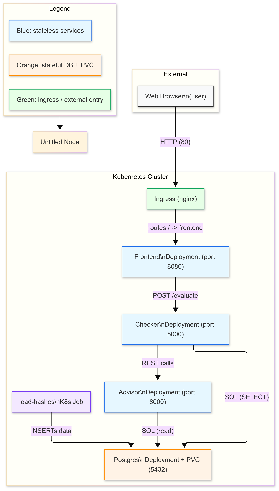

#  Password Advisor – Secure Password Strength & Breach Checker

A Kubernetes-native microservice application that evaluates password strength and checks if a password has been exposed in known data breaches — all **without sending your password over the internet**.

>  **Privacy-first**: Your password never leaves your cluster.  
>  **Self-contained**: Uses a local database of breached password hashes (SHA1).  
>  **Production-ready**: Built with FastAPI, PostgreSQL, and Ingress on Kubernetes.

---

## How it work 

1. User visits the frontend → automatically redirected to `/checker.html`
2. Enters a password → sent to **Advisor** service (`/evaluate`)
3. **Advisor**:
   - Runs local strength checks (length, charset, patterns)
   - Calls **Checker** service to see if hash exists in breach DB
4. Returns combined result: **score**, **breach status**, and **actionable tips**

## Architecture Diagram

  
##### Flow summary: 
1. **User** → visits via web browser (HTTP/80)
2. **Ingress (nginx)** routes `/` → `Frontend` service (port 8080)
3. **Frontend** sends `POST /evaluate` to `Advisor` (port 8000)
4. **Advisor** calls `Checker` (port 8000) for breach check
5. **Checker & Advisor** both query `Postgres` (port 5432) via SQL
6. **load-hashes Job** populates database at startup (INSERTs data)

#### Legend: 

- **Blue**: Stateless services (`Frontend`, `Advisor`, `Checker`)
- **Orange**: Stateful DB + PVC (`Postgres`)
- **Green**: Ingress / external entry point
- **Purple**: One-time job (`load-hashes`)

## Services Overview

| Service | Tech | Port | Role |
|--------|------|------|------|
| **Frontend** | Static HTML/JS | 8080 | User interface (served via Ingress) |
| **Advisor** | Python / FastAPI | 8000 | Main logic: score + recommendations |
| **Checker** | Python / FastAPI + SQLAlchemy | 8000 | Checks if password hash exists in DB |
| **PostgreSQL** | - | 5432 | Stores breached password hashes (SHA1) |
| **loadhashes** | Python job | - | Loads `leaked_password_hashes.txt` into DB on startup |

> All communication between services happens **inside the cluster** – no external APIs.


## Project Structure

```text
.
├── advisor
│   ├── Dockerfile
│   ├── main.py
│   └── requirements.txt
├── checker
│   ├── Dockerfile
│   ├── database.py
│   ├── load_to_db.py
│   ├── leaked_password_hashes.txt
│   ├── main.py
│   ├── models.py
│   └── requirements.txt
├── docs
│   └── architecture.png
├── frontend
│   ├── Dockerfile
│   ├── checker.html
│   └── index.html
├── k8s
│   ├── advisor-deploy.yaml
│   ├── advisor-svc.yaml
│   ├── checker-deploy.yaml
│   ├── checker-svc.yaml
│   ├── frontend-deploy.yaml
│   ├── frontend-svc.yaml
│   ├── ingress.yaml
│   ├── load-hashes-job.yaml
│   ├── namespace.yaml
│   ├── postgres-deploy.yaml
│   ├── postgres-pvc.yaml
│   └── postgres-svc.yaml
├── Makefile
└── README.md
```
## Quick Start (Minikube)

### Prerequisites
- [Minikube](https://minikube.sigs.k8s.io/docs/start/)
- `kubectl`, `docker`, `make`, `Python`

### 1. Start Minikube & Enable Ingress
```bash
minikube start
minikube addons enable ingress

```
### 2. Deploy the Application using the Makefile

````
make all 
````

### 3. Access the App 
````
make test-ingress

````
### Makefile commands 

| Target         | Description                  |
| -------------- | ---------------------------------------- |
| `all`          | Full deployment (everything).            |
| `namespace`    | Apply namespace YAML.                    |
| `create-secret`    |Create Kubernetes secret interactively .                    |
| `db`           | Apply Postgres PVC, deployment, service. |
| `wait-db`      | Wait for Postgres rollout.               |
| `job`          | Run/load leaked-hashes job.              |
| `deploy-app`   | Deploy checker/advisor/frontend.         |
| `ingress`      | Apply ingress and show status.           |
| `test`         | Show pods/services/endpoints.            |
| `test-db`      | Query leaked_passwords count.            |
| `test-ingress` | Print frontend URL (`/checker.html`).    |
| `logs`         | Tail logs for debugging.                 |
| `clean`        | Delete application namespace.            |
| `reset-db`     | Delete PVC to reset DB storage.          |
| `build-images` | Build Docker images locally.             |
| `push-images`  | Push images to registry.                 |

#### Data & Privacy 
1. **Breach database**: loaded from `/checker/leaked_password_hashes.txt` (sha1). 
2. **No plaintext passwords stored**: Only SHA1 hashes in PostgreSQL. 
3. **No external calls**: All checks happen locally in the cluster.
4. **No loggging**: Frontend explicity states: *The applicaiton does not log your password*. 

